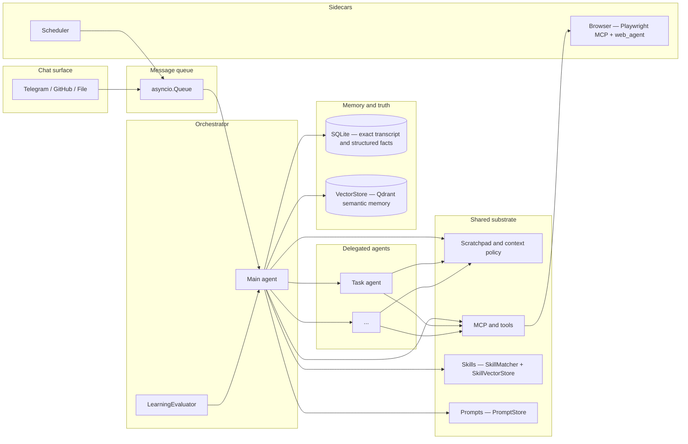
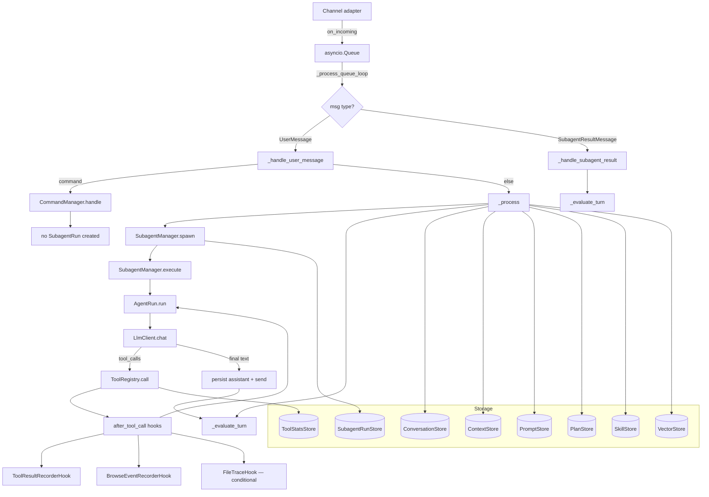

# NanoBot architecture

This document describes **what we are building**, **how context and capabilities are meant to fit together**, and **what the code does today**. For phased work and open questions, see [ROADMAP.md](ROADMAP.md).

---

## Vision

NanoBot is a **personal agent** you talk to over chat (Telegram today). It should run comfortably on **your own hardware or a small cloud slice**, so the design favors **efficiency** and **intelligent context management** over always-on huge prompts or heavyweight stacks.

The **main agent is an orchestrator**: it can **delegate** to other agents for focused jobs (research, calendar upkeep, a multi-step browser flow, and so on). All agents share a common substrate: **tools and MCP servers**, a **scratchpad** (working memory and plans, in the spirit of "plan mode" in coding agents), and access to **durable stores** where each store has a clear job.

**Scope**: help with **browser-centric and API-shaped life tasks**—search, news, calendars, forms, logged-in sites when you allow it—not a "full machine" agent. More capable than "MCPs only" as a product story (orchestration, memory layers, scheduling), but **narrower and more controlled** than full-device assistants.

---

## Conceptual architecture (target)

**Ideas encoded here**

- **Orchestrator vs workers**: one conversational "owner" that can spin up or hand off to specialized agent loops when useful (design still evolving; see roadmap).
- **Scratchpad + context policy**: bounded chat history, explicit working notes, and rules for what gets promoted to long-term memory or kept only in-session.
- **Three memory modes**: **SQLite** for **exact** replay and structured data (messages, scheduler rows, plans, skills metadata, prompts, tool stats, subagent runs); **ContextStore** (SQLite `contexts` table) for **mutable working state** (scratchpad, pointers, traces); **VectorStore** (Qdrant) for **associative** semantic recall across three collections (memories, skills, web_scripts).
- **Skills**: SkillStore for definitions and trigger configuration, SkillMatcher for injection, SkillVectorStore for semantic skill lookup. The evaluator can auto-create or update skills from learnings.
- **Scheduler** alongside the agent: time-based nudges and jobs without blocking the chat loop.
- **Browser** as a first-class capability through **two systems**: the external **Playwright MCP** (standalone server, multi-tab support, auto-popup detection) and the built-in **web_agent** (`interact_page` MCP tool wrapping `BrowserInteractor` for structured page navigation, snapshot, and multi-tab interaction).
- **Message queue**: an `asyncio.Queue` sits between channels and core, serializing all incoming messages (user messages and subagent results) for ordered processing.

---

## Context strategy (design intent)

| Layer | Role | Typical content |
| ----- | ---- | ---------------- |
| **Chat window** | What the model sees this turn | Recent messages, capped; system + scratchpad injection |
| **Scratchpad / context store** | Mutable working state | Plans, checklists, pointers, compact tool/browse traces |
| **SQLite** | Source of truth for exact data | Full transcript, schedule rows, plans, skills metadata, prompts, tool stats, subagent runs |
| **VectorStore (Qdrant)** | Long-horizon semantic recall | Facts, preferences, skill embeddings, web script embeddings across three collections |

Efficiency means **aggressive budgeting** (what goes into the prompt, how often, in what form) and **clear promotion rules** (what becomes a VectorStore memory vs what stays in scratchpad vs what is only in SQLite for audit).

---

## Capability map

| Capability | Role today | Notes |
| ---------- | ---------- | ----- |
| **Channels** | Telegram, GitHub, File (extensible pattern) | `Channel` + `set_handler` → `BotCore.on_incoming` |
| **Scratchpad** | Working memory in context store | Plan/scratchpad commands; injected as user-role message via PromptStore templates |
| **MCP hub** | Tools (browser, memory, ...) | Namespaced tools; `McpHub.call_tool` in the agent loop |
| **Browser** | Two systems: external Playwright MCP + built-in web_agent | External MCP: multi-tab, auto-popup detection, `switch_tab`. Built-in: `interact_page` tool via `BrowserInteractor` for structured navigation, snapshot, extraction. Browse hooks record traces. |
| **Scheduler** | Due tasks → core callback | `SchedulerStore` + `SchedulerRunner` |
| **SQLite** | `ConversationStore`, `ContextStore`, scheduler, plans, skills, prompts, tool stats | Exact history, blobs, and structured metadata |
| **VectorStore** | Built-in memory tools with Qdrant (memories/skills/web_scripts collections) | 7 direct built-in tools registered via `register_memory_tools`; no longer an MCP server |
| **Skills** | SkillStore + SkillMatcher + SkillVectorStore | Trigger matching (keyword/intelligent); evaluator-driven lifecycle; vector-backed semantic lookup |
| **Evaluator** | Three-phase skill lifecycle evaluator | Quality assessment, learning extraction, skill lifecycle decisions; enabled via `enable_evaluator: true` |
| **Plans** | PlanStore with step tracking | Structured plans with success/failure tracking per step |
| **Web Scripts** | VectorStore `web_scripts` collection | Stored browser automation scripts with semantic retrieval |
| **PromptStore** | Centralized prompt templates | Versioning, variable rendering via `PromptStore.render` |
| **Task dashboard** | Not built | Linear-like UX is aspirational; likely backed by SQLite + UI or deep links later |

---

## Current runtime (implementation)

User messages flow through `BotCore` → `asyncio.Queue` → `_process_queue_loop` → `SubagentManager` → `AgentRun`. Each non-command message creates a `SubagentRun` record for observability.

**Message flow:**

1. **`main.py`** — Loads config, builds channels and `BotCore`, wires `Channel.set_handler(core.on_incoming)`.
2. **`BotCore.on_incoming`** — Enqueues `UserMessage` to `asyncio.Queue`. Similarly, `on_subagent_result` enqueues `SubagentResultMessage`.
3. **`_process_queue_loop`** — Async loop that dequeues messages one at a time, dispatching `UserMessage` to `_handle_user_message` or `SubagentResultMessage` to `_handle_subagent_result`.
4. **`BotCore._handle_user_message`** — Routes to `CommandManager` for slash commands, else `_process`.
5. **`_process`** — Persists user message, clears scratchpad, builds messages with history.
6. **`SubagentManager.spawn`** — Creates `SubagentRun` record in SQLite (`subagent_runs` table).
7. **`SubagentManager.execute`** — Calls `AgentRun.run()` with messages and tools, records completion.
8. **`AgentRun.run`** — LLM chat loop; tool calls through `ToolRegistry.call()` (records to `tool_calls` with `run_id`). When scratchpad is finalized, the loop breaks and makes one explicit no-tools LLM call with the `finalize_response` prompt to produce the final answer.
9. **After turn** — Persist assistant message, update context, send reply via `_send`. Then `_evaluate_turn` runs the `LearningEvaluator` if enabled, which may auto-create or update skills based on learnings extracted from the turn.

**Slash commands bypass SubagentManager** — they execute directly without creating run records.

### Storage boundaries

| Store | File | Table | Purpose |
| ----- | ---- | ----- | ------- |
| **ConversationStore** | `memory.py` | `messages` | Full chat transcript |
| **ContextStore** | `context_store.py` | `contexts` | Scoped JSON (scratchpad, pointers, traces) |
| **SchedulerStore** | `scheduler_store.py` | `scheduled_tasks` | Time-based task queue |
| **SubagentRunStore** | `subagents/store.py` | `subagent_runs` | Run metadata (scope, status, timing) |
| **ToolStatsStore** | `tools/stats.py` | `tool_calls` | Tool invocations with `run_id` link |
| **PromptStore** | `prompts/store.py` | `prompts` | Centralized prompt templates (versioning, variable rendering) |
| **PlanStore** | `plans/store.py` | `plans` | Structured plans with steps and success/failure tracking |
| **SkillStore** | `skills/store.py` | `skills` | Skill definitions and trigger configuration |
| **VectorStore** | `vector_store/store.py` | Qdrant collections | Multi-collection vector storage (memories, skills, web_scripts) |

**Key relationships:**
- `subagent_runs.id` ← `tool_calls.run_id` — Links tool calls to specific runs
- `subagent_runs.scope` — Chat scope (e.g. `telegram:500506690`)
- `contexts` — Stores run goal/status/result under `subagent_run:{id}` scope

### Hooks (`src/nanobot/hooks/`)

- **Channel → core**: `Channel.set_handler` in `channels/base.py`.
- **Scheduler → core**: `SchedulerRunner(..., on_due_task=...)` → `_handle_scheduled_task`.
- **After each tool call**: `ToolCallEvent` in `hooks/tool_hooks.py`; `ToolHook.after_tool_call(event, bot)`; `BotCore._dispatch_after_tool_call`. Built-ins: `ToolResultRecorderHook`, `BrowseEventRecorderHook` (playwright tools). **`FileTraceHook`** is conditionally registered when a `FileChannel` has `capture_tool_calls=true`, writing tool call/result events to the session output file.
- **Prompt shaping**: `scratchpad_system_message` (standalone function in `core_scratchpad.py`), `scratchpad_assistant_message` (standalone function in `core_scratchpad.py`, renders user-role message), `prepare_messages_for_chat` (standalone function in `agent_run.py`), `_system_messages` (method on `BotCore`).

**Hook event fields** (`after_tool_call`): `scope`, `call_id`, `tool_name`, `args`, `result`, `result_preview`, `ok`, `error`, `at`.

**Policy**: Hook failures are isolated; a failing hook must not break the tool loop or the user turn.

### Agent loop exit paths (`AgentRun.run`)

The tool-calling loop has four exit conditions:

1. **Implicit text response** — Model returns no `tool_calls`; loop exits with the text reply.
2. **Scratchpad finalize** — When `scratchpad_write(mode=finalize)` is called, the loop breaks and makes one explicit LLM call with **no tools** and the `finalize_response` prompt (goal + summary from scratchpad state). The model must return a plain text answer.
3. **Tool call limit** (30) — `MAX_TOOL_CALLS_PER_TURN` exceeded triggers a soft landing: the loop makes a no-tools LLM call with the `tool_call_limit_finalize` prompt (goal + accumulated summary from scratchpad). The model gets to summarize and produce a final answer rather than receiving a hard abort.
4. **Identical tool call repeat** (3x) — `MAX_IDENTICAL_TOOL_CALL_REPEATS` exceeded returns a fixed error reply. This is a hard abort.

The finalize path is critical for local/smaller models: without an explicit no-tools call, models tend to hallucinate `scratchpad_write(init)` after finalize, which wipes all accumulated state.

### Browser multi-tab (`web_agent/browser/interactor.py`)

The system provides **two browser capabilities**:

**External Playwright MCP** — A standalone MCP server (`@playwright/mcp`) configured in `config.yaml`. Provides raw browser interaction tools (`playwright__navigate`, `playwright__click`, etc.) with multi-tab support. `BrowseEventRecorderHook` records all `playwright__` tool events.

**Built-in web_agent** — The `interact_page` MCP tool wrapping `BrowserInteractor` for structured page interaction. `BrowserInteractor.click()` uses `context.expect_page()` to detect new tabs opened by `target="_blank"` links. When detected:

1. The old page is compressed to `{url, title}` and stored in `_background_tabs`.
2. `self.page` switches to the new tab automatically.
3. `switch_tab(index)` returns to a background tab by `context.pages` index.

The `interact_page` MCP tool reports `background_tabs` (url+title for each) and `step_urls` (compact step summary) so the LLM knows what tabs are available.

### After turn: evaluator

After each completed subagent turn, `BotCore._evaluate_turn` runs (if `enable_evaluator: true` in config):

1. **Quality Assessment** — Evaluates the turn for completeness and usefulness.
2. **Learning Extraction** — Conditionally extracts learnings from the turn when quality is sufficient.
3. **Skill Lifecycle** — Makes decisions about skill creation, update, or skip based on extracted learnings.

The evaluator may auto-create skills in `SkillStore` and sync them to `SkillVectorStore` for semantic matching. Each operation is independent and fault-tolerant; a failing skill operation does not block others.

### Future hooks (suggested, not contracted)

`before_llm_call`, `after_llm_call`, `before_tool_call`, `on_turn_complete`, `on_error`.

---

## Related documents

- [ROADMAP.md](ROADMAP.md) — Phases, milestones, and open design choices.