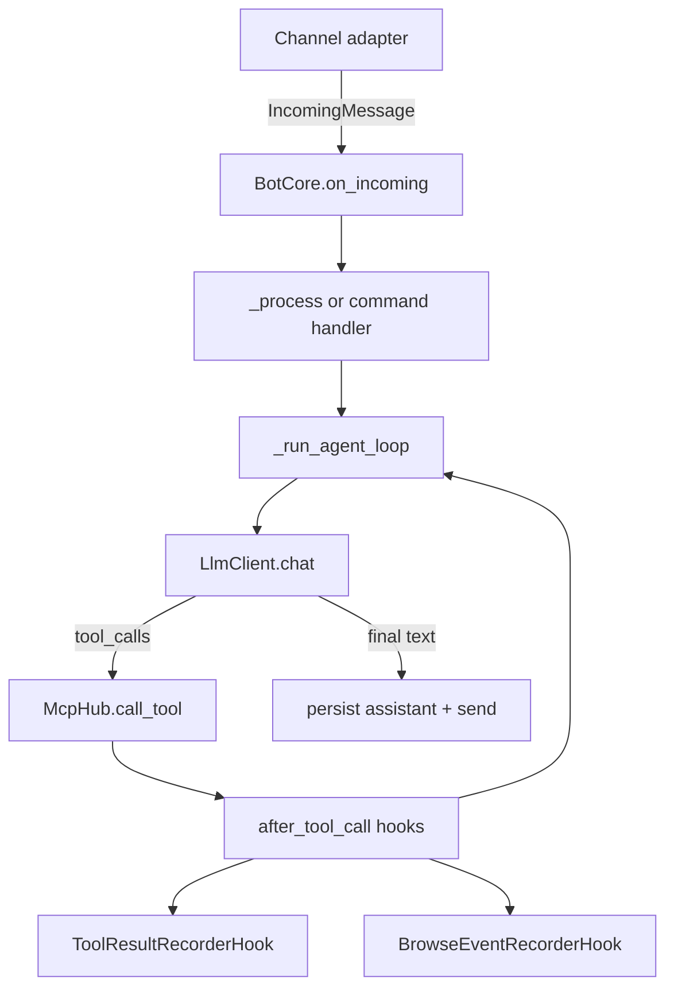

# nanobot Architecture

This document describes the current runtime architecture and extension points ("hooks") used in code.

## Runtime diagram

## Core runtime path

1. `src/nanobot/main.py`
   - Loads config.
   - Builds channels.
   - Creates `BotCore`.
   - Wires channel handler via `Channel.set_handler(core.on_incoming)`.

2. `src/nanobot/core.py` (`BotCore`)
   - Entry point: `on_incoming(message)`.
   - Routes commands (`/help`, `/ctx`, `/ctxfull`, `/reset`, `/plan`, `/scratchpad`).
   - Non-command messages go to `_process(...)`.

3. Message preparation in `_process(...)`
   - Persists user message to `ConversationStore` (`messages` table).
   - Stores lightweight pointers in `ContextStore` (`contexts` table).
   - Builds LLM message list:
     - base system prompt
     - scratchpad system message
     - bounded recent chat history
   - Runs `_run_agent_turn(...)`.

4. Agent loop in `_run_agent_loop(...)`
   - Calls `LlmClient.chat(...)`.
   - If assistant returns tool calls:
     - executes each tool via `McpHub.call_tool(...)`
     - appends tool result back into chat messages
     - repeats until no more tool calls
   - Returns final assistant text.

5. Persistence after turn
   - Final assistant message stored in `ConversationStore`.
   - `last_assistant_message` stored in `ContextStore`.
   - Reply sent to channel via `_send(...)`.

## Storage boundaries

- `ConversationStore` (`src/nanobot/memory.py`)
  - durable chat transcript (`messages`)
  - user + assistant messages only
- `ContextStore` (`src/nanobot/context_store.py`)
  - scoped JSON blobs (`contexts`)
  - scratchpad, last message pointers, browse/tool traces, plan-run metadata
- `SchedulerStore` (`src/nanobot/scheduler_store.py`)
  - scheduled tasks (`scheduled_tasks`)

## Hook architecture (current)

Hooks are now organized under `src/nanobot/hooks/` and executed from `BotCore`.

1. Channel -> core callback
   - `Channel.set_handler(...)` in `src/nanobot/channels/base.py`
   - Used by `main.py` to inject `core.on_incoming`.

2. Scheduler -> core callback
   - `SchedulerRunner(..., on_due_task=...)` in `src/nanobot/scheduler_runner.py`
   - Used by `BotCore` with `self._handle_scheduled_task`.

3. Tool call hooks (formalized)
   - `ToolCallEvent` schema in `src/nanobot/hooks/tool_hooks.py`
   - Hook protocol: `ToolHook.after_tool_call(event, bot)`
   - Dispatcher in `BotCore._dispatch_after_tool_call(...)`
   - Called once after each tool execution (success or failure).

4. Built-in hook implementations
   - `ToolResultRecorderHook`
     - Persists compact tool trace to `contexts(chat, scope, "tool_results")`.
   - `BrowseEventRecorderHook`
     - Runs only for `playwright__*` tools.
     - Persists browse history to `contexts(chat, scope, "browse_history")`.

5. Prompt shaping extension points
   - `BotCore._scratchpad_system_message(...)` (inject internal scratchpad state)
   - `BotCore._prepare_messages_for_chat(...)` (merge system messages for template compatibility)

## Hook event schema (`after_tool_call`)

- `scope`: scoped chat id (`channel:chat_id`)
- `call_id`: model tool call id
- `tool_name`: namespaced MCP tool name (`server__tool`)
- `args`: decoded tool arguments
- `result`: normalized tool result text
- `result_preview`: clipped preview for lightweight storage/logging
- `ok`: success flag
- `error`: error message if tool failed
- `at`: human-readable timestamp

## Error handling policy

- Hook failures are isolated.
- `BotCore` catches and logs hook exceptions per hook.
- A failing hook must not break the tool loop or user turn.

## Future hooks (suggested)

- `before_llm_call(payload)`
- `after_llm_call(result)`
- `before_tool_call(event)`
- `on_turn_complete(summary)`
- `on_error(error_event)`
