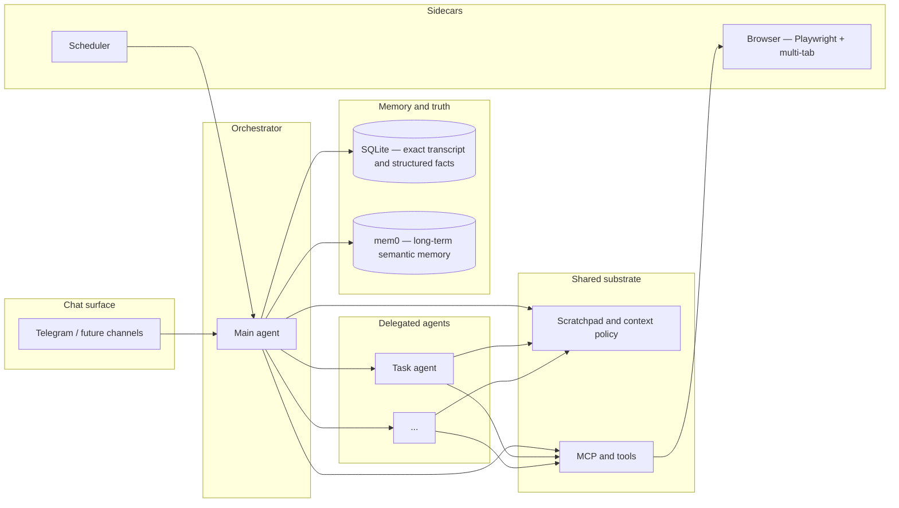
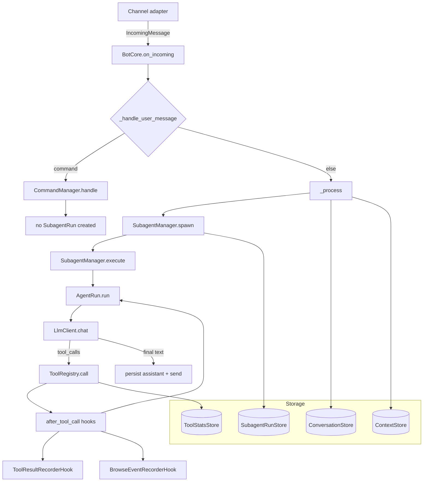

# NanoBot architecture

This document describes **what we are building**, **how context and capabilities are meant to fit together**, and **what the code does today**. For phased work and open questions, see [ROADMAP.md](ROADMAP.md).

---

## Vision

NanoBot is a **personal agent** you talk to over chat (Telegram today). It should run comfortably on **your own hardware or a small cloud slice**, so the design favors **efficiency** and **intelligent context management** over always-on huge prompts or heavyweight stacks.

The **main agent is an orchestrator**: it can **delegate** to other agents for focused jobs (research, calendar upkeep, a multi-step browser flow, and so on). All agents share a common substrate: **tools and MCP servers**, a **scratchpad** (working memory and plans, in the spirit of “plan mode” in coding agents), and access to **durable stores** where each store has a clear job.

**Scope**: help with **browser-centric and API-shaped life tasks**—search, news, calendars, forms, logged-in sites when you allow it—not a “full machine” agent. More capable than “MCPs only” as a product story (orchestration, memory layers, scheduling), but **narrower and more controlled** than full-device assistants.

---

## Conceptual architecture (target)

**Ideas encoded here**

- **Orchestrator vs workers**: one conversational “owner” that can spin up or hand off to specialized agent loops when useful (design still evolving; see roadmap).
- **Scratchpad + context policy**: bounded chat history, explicit working notes, and rules for what gets promoted to long-term memory or kept only in-session.
- **Two memory modes**: **SQLite** for **exact** replay and structured data (messages, scheduler rows, anything that must not be fuzzy); **mem0** (via the memory MCP) for **associative** long-term recall.
- **Scheduler** alongside the agent: time-based nudges and jobs without blocking the chat loop.
- **Browser** as a first-class capability through **Playwright MCP with multi-tab support** — clicks that open new tabs are auto-detected and switched to; background tabs (url+title) are tracked for return navigation.

---

## Context strategy (design intent)

| Layer | Role | Typical content |
| ----- | ---- | ---------------- |
| **Chat window** | What the model sees this turn | Recent messages, capped; system + scratchpad injection |
| **Scratchpad / context store** | Mutable working state | Plans, checklists, pointers, compact tool/browse traces |
| **SQLite** | Source of truth for exact data | Full transcript, schedule rows, future structured tasks |
| **mem0** | Long-horizon recall | Facts, preferences, summaries the user is okay remembering |

Efficiency means **aggressive budgeting** (what goes into the prompt, how often, in what form) and **clear promotion rules** (what becomes a mem0 memory vs what stays in scratchpad vs what is only in SQLite for audit).

---

## Capability map

| Capability | Role today | Notes |
| ---------- | ---------- | ----- |
| **Channels** | Telegram (extensible pattern) | `Channel` + `set_handler` → `BotCore.on_incoming` |
| **Scratchpad** | Working memory in context store | Plan/scratchpad commands; injected as system-side context |
| **MCP hub** | Tools (browser, memory, …) | Namespaced tools; `McpHub.call_tool` in the agent loop |
| **Browser** | Playwright MCP + multi-tab | Auto-popup detection; `switch_tab` for background tabs; browse hooks record traces |
| **Scheduler** | Due tasks → core callback | `SchedulerStore` + `SchedulerRunner` |
| **SQLite** | `ConversationStore`, `ContextStore`, scheduler | Exact history and blobs |
| **mem0** | Long-term memory MCP | Optional; configured via mem0 config + MCP server |
| **Task dashboard** | Not built | Linear-like UX is aspirational; likely backed by SQLite + UI or deep links later |

---

## Current runtime (implementation)

User messages flow through `BotCore` → `SubagentManager` → `AgentRun`. Each non-command message creates a `SubagentRun` record for observability.

**Message flow:**

1. **`main.py`** — Loads config, builds channels and `BotCore`, wires `Channel.set_handler(core.on_incoming)`.
2. **`BotCore._handle_user_message`** — Routes to `CommandManager` for slash commands, else `_process`.
3. **`_process`** — Persists user message, clears scratchpad, builds messages with history.
4. **`SubagentManager.spawn`** — Creates `SubagentRun` record in SQLite (`subagent_runs` table).
5. **`SubagentManager.execute`** — Calls `AgentRun.run()` with messages and tools, records completion.
6. **`AgentRun.run`** — LLM chat loop; tool calls through `ToolRegistry.call()` (records to `tool_calls` with `run_id`). When scratchpad is finalized, the loop breaks and makes one explicit no-tools LLM call with the `finalize_response` prompt to produce the final answer.
7. **After turn** — Persist assistant message, update context, send reply via `_send`.

**Slash commands bypass SubagentManager** — they execute directly without creating run records.

### Storage boundaries

| Store | File | Table | Purpose |
| ----- | ---- | ----- | ------- |
| **ConversationStore** | `memory.py` | `messages` | Full chat transcript |
| **ContextStore** | `context_store.py` | `contexts` | Scoped JSON (scratchpad, pointers, traces) |
| **SchedulerStore** | `scheduler_store.py` | `scheduled_tasks` | Time-based task queue |
| **SubagentRunStore** | `subagents/store.py` | `subagent_runs` | Run metadata (scope, status, timing) |
| **ToolStatsStore** | `tools/stats.py` | `tool_calls` | Tool invocations with `run_id` link |

**Key relationships:**
- `subagent_runs.id` ← `tool_calls.run_id` — Links tool calls to specific runs
- `subagent_runs.scope` — Chat scope (e.g., `telegram:500506690`)
- `contexts` — Stores run goal/status/result under `subagent_run:{id}` scope

### Hooks (`src/nanobot/hooks/`)

- **Channel → core**: `Channel.set_handler` in `channels/base.py`.
- **Scheduler → core**: `SchedulerRunner(..., on_due_task=...)` → `_handle_scheduled_task`.
- **After each tool call**: `ToolCallEvent` in `hooks/tool_hooks.py`; `ToolHook.after_tool_call(event, bot)`; `BotCore._dispatch_after_tool_call`. Built-ins: `ToolResultRecorderHook`, `BrowseEventRecorderHook` (playwright tools).
- **Prompt shaping**: `_scratchpad_system_message`, `_prepare_messages_for_chat`.

**Hook event fields** (`after_tool_call`): `scope`, `call_id`, `tool_name`, `args`, `result`, `result_preview`, `ok`, `error`, `at`.

**Policy**: Hook failures are isolated; a failing hook must not break the tool loop or the user turn.

### Agent loop exit paths (`AgentRun.run`)

The tool-calling loop has three exit conditions:

1. **Implicit text response** — Model returns no `tool_calls`; loop exits with the text reply.
2. **Scratchpad finalize** — When `scratchpad_write(mode=finalize)` is called, the loop breaks immediately and makes one explicit LLM call with **no tools** and the `finalize_response` prompt (goal + summary from scratchpad state). The model must return a plain text answer.
3. **Abort** — `MAX_TOOL_CALLS_PER_TURN` (30) or `MAX_IDENTICAL_TOOL_CALL_REPEATS` (3) exceeded returns a fixed error reply.

The finalize path is critical for local/smaller models: without an explicit no-tools call, models tend to hallucinate `scratchpad_write(init)` after finalize, which wipes all accumulated state.

### Browser multi-tab (`web_agent/browser/interactor.py`)

`BrowserInteractor.click()` uses `context.expect_page()` to detect new tabs opened by `target="_blank"` links. When detected:

1. The old page is compressed to `{url, title}` and stored in `_background_tabs`.
2. `self.page` switches to the new tab automatically.
3. `switch_tab(index)` returns to a background tab by `context.pages` index.

The `interact_page` MCP tool reports `background_tabs` (url+title for each) and `step_urls` (compact step summary) so the LLM knows what tabs are available.

### Future hooks (suggested, not contracted)

`before_llm_call`, `after_llm_call`, `before_tool_call`, `on_turn_complete`, `on_error`.

---

## Related documents

- [ROADMAP.md](ROADMAP.md) — Phases, milestones, and open design choices.
