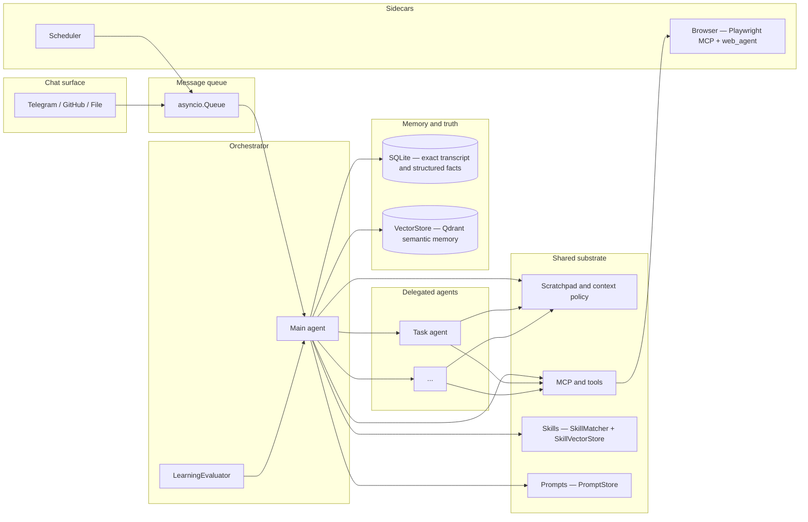
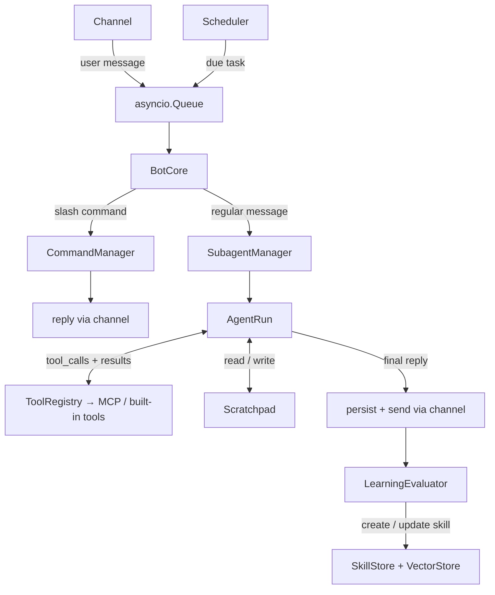

# NanoBot architecture

This document describes **what we are building**, **how context and capabilities are meant to fit together**, and **what the code does today**. For phased work and open questions, see [ROADMAP.md](ROADMAP.md).

---

## Vision

NanoBot is a **personal agent** you talk to over chat (Telegram today). It should run comfortably on **your own hardware or a small cloud slice**, so the design favors **efficiency** and **intelligent context management** over always-on huge prompts or heavyweight stacks.

The **main agent is an orchestrator**: it can **delegate** to other agents for focused jobs (research, calendar upkeep, a multi-step browser flow, and so on). All agents share a common substrate: **tools and MCP servers**, a **scratchpad** (working memory and plans, in the spirit of "plan mode" in coding agents), and access to **durable stores** where each store has a clear job.

**Scope**: help with **browser-centric and API-shaped life tasks**—search, news, calendars, forms, logged-in sites when you allow it—not a "full machine" agent. More capable than "MCPs only" as a product story (orchestration, memory layers, scheduling), but **narrower and more controlled** than full-device assistants.

---

## Conceptual architecture (target)

**Ideas encoded here**

- **Orchestrator vs workers**: one conversational "owner" that can spin up or hand off to specialized agent loops when useful (design still evolving; see roadmap).
- **Scratchpad + context policy**: bounded chat history, explicit working notes, and rules for what gets promoted to long-term memory or kept only in-session.
- **Three memory modes**: **SQLite** for **exact** replay and structured data (messages, scheduler rows, plans, skills metadata, prompts, tool stats, subagent runs); **ContextStore** (SQLite `contexts` table) for **mutable working state** (scratchpad, pointers, traces); **VectorStore** (Qdrant) for **associative** semantic recall across three collections (memories, skills, web_scripts).
- **Skills**: SkillStore for definitions and trigger configuration, SkillMatcher for injection, SkillVectorStore for semantic skill lookup. The evaluator can auto-create or update skills from learnings.
- **Scheduler** alongside the agent: time-based nudges and jobs without blocking the chat loop.
- **Browser** as a first-class capability through **two systems**: the external **Playwright MCP** (standalone server, multi-tab support, auto-popup detection) and the built-in **web_agent** (`interact_page` MCP tool wrapping `BrowserInteractor` for structured page navigation, snapshot, and multi-tab interaction).
- **Message queue**: an `asyncio.Queue` sits between channels and core, serializing all incoming messages (user messages and subagent results) for ordered processing.

---

## Context strategy (design intent)

| Layer | Role | Typical content |
| ----- | ---- | ---------------- |
| **Chat window** | What the model sees this turn | Recent messages, capped; system + scratchpad injection |
| **Scratchpad / context store** | Mutable working state | Plans, checklists, pointers, compact tool/browse traces |
| **SQLite** | Source of truth for exact data | Full transcript, schedule rows, plans, skills metadata, prompts, tool stats, subagent runs |
| **VectorStore (Qdrant)** | Long-horizon semantic recall | Facts, preferences, skill embeddings, web script embeddings across three collections |

Efficiency means **aggressive budgeting** (what goes into the prompt, how often, in what form) and **clear promotion rules** (what becomes a VectorStore memory vs what stays in scratchpad vs what is only in SQLite for audit).

---

## Capability map

| Capability | Role today | Notes |
| ---------- | ---------- | ----- |
| **Channels** | Telegram, GitHub, File (extensible pattern) | `Channel` + `set_handler` → `BotCore.on_incoming` |
| **Scratchpad** | Working memory in context store | Plan/scratchpad commands; injected as user-role message via PromptStore templates |
| **MCP hub** | Tools (browser, memory, ...) | Namespaced tools; `McpHub.call_tool` in the agent loop |
| **Browser** | Two systems: external Playwright MCP + built-in web_agent | External MCP: multi-tab, auto-popup detection, `switch_tab`. Built-in: `interact_page` tool via `BrowserInteractor` for structured navigation, snapshot, extraction. Browse hooks record traces. |
| **Scheduler** | Due tasks → core callback | `SchedulerStore` + `SchedulerRunner` |
| **SQLite** | `ConversationStore`, `ContextStore`, scheduler, plans, skills, prompts, tool stats | Exact history, blobs, and structured metadata |
| **VectorStore** | Built-in memory tools with Qdrant (memories/skills/web_scripts collections) | 7 direct built-in tools registered via `register_memory_tools`; no longer an MCP server |
| **Skills** | SkillStore + SkillMatcher + SkillVectorStore | Trigger matching (keyword/intelligent); evaluator-driven lifecycle; vector-backed semantic lookup |
| **Evaluator** | Three-phase skill lifecycle evaluator | Quality assessment, learning extraction, skill lifecycle decisions; enabled via `enable_evaluator: true` |
| **Plans** | PlanStore with step tracking | Structured plans with success/failure tracking per step |
| **Web Scripts** | VectorStore `web_scripts` collection | Stored browser automation scripts with semantic retrieval |
| **PromptStore** | Centralized prompt templates | Versioning, variable rendering via `PromptStore.render` |
| **Task dashboard** | Not built | Linear-like UX is aspirational; likely backed by SQLite + UI or deep links later |

---

## Current runtime (implementation)

### Message flow

**Step by step:**

1. **Incoming** — A channel calls `self.emit(IncomingMessage)` → `BotCore.on_incoming` wraps it as `UserMessage` and enqueues to `asyncio.Queue`. The scheduler also enqueues due tasks as `ScheduledTaskMessage`. Subagent results arrive as `SubagentResultMessage`. The queue serializes all three message types, preventing concurrent runs on the same scope.
2. **Dispatch** — `_process_queue_loop` dequeues one message at a time. Slash commands go to `CommandManager` (no subagent run created). Everything else goes to `_process`.
3. **SubagentManager** — `_process` persists the user message, then `spawn()` creates a `SubagentRun` record for observability. `execute()` hands off to `AgentRun`. Each run gets its own scratchpad keyed by `run_id` (under `subagent_run` scope type), so concurrent runs on the same scope don't clobber each other's working state.
4. **AgentRun** — The LLM chat loop. Each turn: send messages to LLM, if it returns `tool_calls` execute them through `ToolRegistry` and loop, if it returns text exit with the reply. The scratchpad is updated via `session__scratchpad_write` throughout (init → append → finalize). See [SCRATCHPAD.md](docs/SCRATCHPAD.md) for the full lifecycle.
5. **Reply** — Persist the assistant message, update context store, send reply via `channel.send()`.
6. **Evaluate** — After the reply is sent, `_evaluate_turn` runs the `LearningEvaluator` (if enabled). This may auto-create or update skills. See [EVALUATOR.md](docs/EVALUATOR.md) for the three-phase pipeline.

### Component map

| Component | Source | Role |
|-----------|--------|------|
| **BotCore** | `core.py` | Orchestrator: message queue, command dispatch, evaluator integration |
| **LlmClient** | `llm.py` | OpenAI-compatible chat completions client, all LLM I/O logged via `nanobot.llm.io` |
| **AgentRun** | `agent_run.py` | LLM chat loop with tool calling, scratchpad protocol, finalize exit path |
| **SubagentManager** | `subagents/` | Spawn/execute subagent runs with observability tracking |
| **CommandManager** | `core_commands/` | Slash commands: help, ctx, reset, plan, scratchpad, reload, status, session |
| **Scratchpad** | `core_scratchpad.py` | Per-run structured working state (goal, steps, facts, tool journal) |
| **SkillMatcher** | `skills/matcher.py` | Resolves which skills to inject (always/pattern/intelligent) |
| **LearningEvaluator** | `evaluator/runner.py` | Turns good conversations into skills (quality → learning → lifecycle) |
| **McpHub** | `mcp_hub.py` | Connects to configured MCP servers, routes tool calls |
| **ToolRegistry** | `tools/` | Registers and dispatches all tools (MCP + built-in), records stats |
| **PromptStore** | `prompts/` | Centralized prompt templates with variable rendering |
| **SchedulerRunner** | `scheduler_runner.py` | Polls due tasks from scheduler DB, enqueues to BotCore |

Dedicated docs cover the non-obvious subsystems in detail: [SCRATCHPAD.md](docs/SCRATCHPAD.md), [SKILLS.md](docs/SKILLS.md), [EVALUATOR.md](docs/EVALUATOR.md), [CHANNELS.md](docs/CHANNELS.md), [WEB_AGENT.md](docs/WEB_AGENT.md).

### Storage boundaries

| Store | File | Table | Purpose |
| ----- | ---- | ----- | ------- |
| **ConversationStore** | `memory.py` | `messages` | Full chat transcript |
| **ContextStore** | `context_store.py` | `contexts` | Scoped JSON — scratchpad (under `subagent_run:{run_id}` scope per-run, or `chat:{scope}` fallback), pointers, traces |
| **SchedulerStore** | `scheduler_store.py` | `scheduled_tasks` | Time-based task queue |
| **SubagentRunStore** | `subagents/store.py` | `subagent_runs` | Run metadata (scope, status, timing) |
| **ToolStatsStore** | `tools/stats.py` | `tool_calls` | Tool invocations with `run_id` link |
| **PromptStore** | `prompts/store.py` | `prompts` | Centralized prompt templates (versioning, variable rendering) |
| **PlanStore** | `plans/store.py` | `plans` | Structured plans with steps and success/failure tracking |
| **SkillStore** | `skills/store.py` | `skills` | Skill definitions and trigger configuration |
| **VectorStore** | `vector_store/store.py` | Qdrant collections | Multi-collection vector storage (memories, skills, web_scripts) |

**Key relationships:**
- `subagent_runs.id` ← `tool_calls.run_id` — Links tool calls to specific runs
- `subagent_runs.scope` — Chat scope (e.g. `telegram:500506690`)
- `contexts` — Stores run goal/status/result/skill-injection under `subagent_run:{id}` scope
- `contexts` — Stores per-run scratchpad under `subagent_run:{run_id}` scope; `_process` no longer clears scratchpad since each run is isolated

### Hooks

Three integration points connect components to the core:

- **Channel → core**: `Channel.set_handler` → `BotCore.on_incoming` → `UserMessage` enqueued.
- **Scheduler → core**: `SchedulerRunner(on_due_task=...)` → `ScheduledTaskMessage` enqueued (serialized with user messages via `asyncio.Queue`). `mark_ran(task_id, cron_expr)` is called at enqueue time to prevent re-enqueue on the next poll cycle.
- **After each tool call**: `ToolHook.after_tool_call(event, bot)` dispatched by `BotCore._dispatch_after_tool_call`. Built-in hooks: `ToolResultRecorderHook` (all tool calls), `BrowseEventRecorderHook` (`playwright__*` only), `FileTraceHook` (conditional, when FileChannel has `capture_tool_calls=true`).

**Event fields**: `scope`, `call_id`, `tool_name`, `args`, `result`, `result_preview`, `ok`, `error`, `at`.

**Policy**: Hook failures are isolated; a failing hook must not break the tool loop or the user turn.

### Agent loop exit paths

The tool-calling loop has four exit conditions. Two use the scratchpad to produce a final answer:

1. **Implicit text response** — Model returns no `tool_calls`; loop exits with the text reply.
2. **Scratchpad finalize** — `scratchpad_write(mode=finalize)` breaks the loop and makes one no-tools LLM call with the `finalize_response` prompt (goal + summary from scratchpad). See [SCRATCHPAD.md](docs/SCRATCHPAD.md).
3. **Tool call limit** (30) — Soft landing: no-tools LLM call with `tool_call_limit_finalize` prompt so the model can summarize partial progress.
4. **Identical tool call repeat** (3x) — Hard abort with a fixed error reply.

### Browser

Two browser capabilities coexist. See [WEB_AGENT.md](docs/WEB_AGENT.md) for full details.

- **External Playwright MCP** — Standalone MCP server with raw browser tools (`playwright__*`). Multi-tab support, auto-popup detection.
- **Built-in web agent** — `interact_page` tool wrapping `BrowserInteractor` for structured page interaction, content extraction, and multi-tab navigation.

### After turn: evaluator

After each completed subagent turn, the `LearningEvaluator` runs (if enabled) and may auto-create or update skills. See [EVALUATOR.md](docs/EVALUATOR.md) for the three-phase pipeline.

### Future hooks (suggested, not contracted)

`before_tool_call`, `on_turn_complete`, `on_error`.

LLM call observability is now handled by the `nanobot.llm.io` logger (see [docs/logging.md](docs/logging.md)).

---

## Related documents

- [ROADMAP.md](ROADMAP.md) — Phases, milestones, and open design choices.
- [docs/SCRATCHPAD.md](docs/SCRATCHPAD.md) — Scratchpad lifecycle, modes, and limits.
- [docs/SKILLS.md](docs/SKILLS.md) — Skill schema, trigger modes, matching, and CRUD tools.
- [docs/EVALUATOR.md](docs/EVALUATOR.md) — Three-phase evaluation pipeline and fault tolerance.
- [docs/CHANNELS.md](docs/CHANNELS.md) — Channel interface and how to add a new one.
- [docs/WEB_AGENT.md](docs/WEB_AGENT.md) — Dual browser system, actions, and content extraction pipeline.
- [docs/logging.md](docs/logging.md) — Logging configuration, per-module handlers, and LLM call logging.