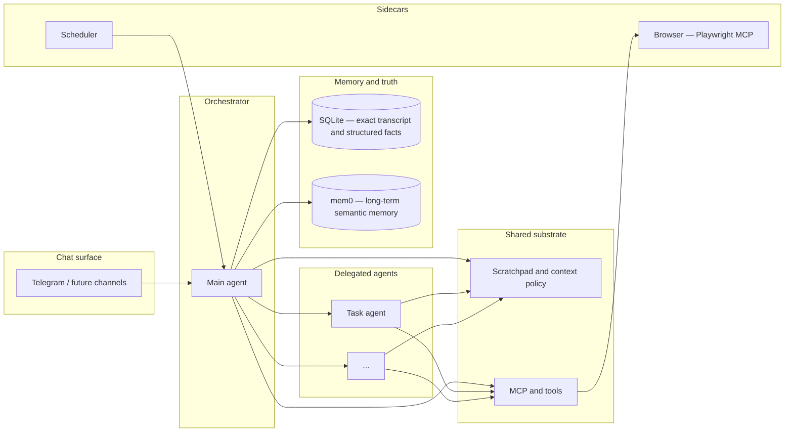
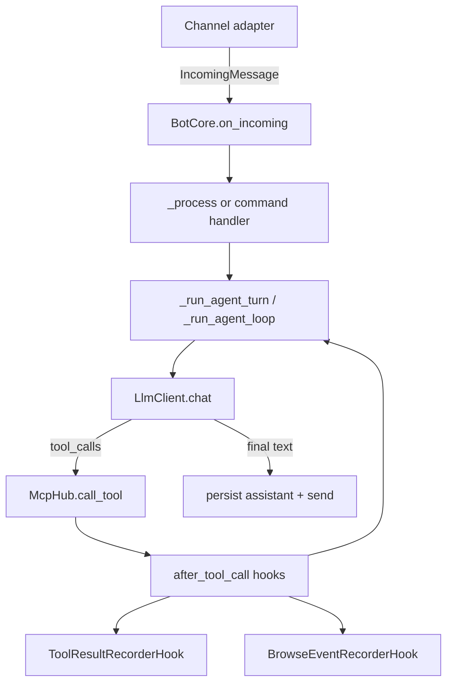

# NanoBot architecture

This document describes **what we are building**, **how context and capabilities are meant to fit together**, and **what the code does today**. For phased work and open questions, see [ROADMAP.md](ROADMAP.md).

---

## Vision

NanoBot is a **personal agent** you talk to over chat (Telegram today). It should run comfortably on **your own hardware or a small cloud slice**, so the design favors **efficiency** and **intelligent context management** over always-on huge prompts or heavyweight stacks.

The **main agent is an orchestrator**: it can **delegate** to other agents for focused jobs (research, calendar upkeep, a multi-step browser flow, and so on). All agents share a common substrate: **tools and MCP servers**, a **scratchpad** (working memory and plans, in the spirit of “plan mode” in coding agents), and access to **durable stores** where each store has a clear job.

**Scope**: help with **browser-centric and API-shaped life tasks**—search, news, calendars, forms, logged-in sites when you allow it—not a “full machine” agent. More capable than “MCPs only” as a product story (orchestration, memory layers, scheduling), but **narrower and more controlled** than full-device assistants.

---

## Conceptual architecture (target)

**Ideas encoded here**

- **Orchestrator vs workers**: one conversational “owner” that can spin up or hand off to specialized agent loops when useful (design still evolving; see roadmap).
- **Scratchpad + context policy**: bounded chat history, explicit working notes, and rules for what gets promoted to long-term memory or kept only in-session.
- **Two memory modes**: **SQLite** for **exact** replay and structured data (messages, scheduler rows, anything that must not be fuzzy); **mem0** (via the memory MCP) for **associative** long-term recall.
- **Scheduler** alongside the agent: time-based nudges and jobs without blocking the chat loop.
- **Browser** as a first-class capability through **Playwright MCP**, not as “random shell access.”

---

## Context strategy (design intent)

| Layer | Role | Typical content |
| ----- | ---- | ---------------- |
| **Chat window** | What the model sees this turn | Recent messages, capped; system + scratchpad injection |
| **Scratchpad / context store** | Mutable working state | Plans, checklists, pointers, compact tool/browse traces |
| **SQLite** | Source of truth for exact data | Full transcript, schedule rows, future structured tasks |
| **mem0** | Long-horizon recall | Facts, preferences, summaries the user is okay remembering |

Efficiency means **aggressive budgeting** (what goes into the prompt, how often, in what form) and **clear promotion rules** (what becomes a mem0 memory vs what stays in scratchpad vs what is only in SQLite for audit).

---

## Capability map

| Capability | Role today | Notes |
| ---------- | ---------- | ----- |
| **Channels** | Telegram (extensible pattern) | `Channel` + `set_handler` → `BotCore.on_incoming` |
| **Scratchpad** | Working memory in context store | Plan/scratchpad commands; injected as system-side context |
| **MCP hub** | Tools (browser, memory, …) | Namespaced tools; `McpHub.call_tool` in the agent loop |
| **Browser** | Playwright MCP | Browse hooks record traces into context |
| **Scheduler** | Due tasks → core callback | `SchedulerStore` + `SchedulerRunner` |
| **SQLite** | `ConversationStore`, `ContextStore`, scheduler | Exact history and blobs |
| **mem0** | Long-term memory MCP | Optional; configured via mem0 config + MCP server |
| **Task dashboard** | Not built | Linear-like UX is aspirational; likely backed by SQLite + UI or deep links later |

---

## Current runtime (implementation)

Today there is a **single primary agent loop** in `BotCore` (orchestrated sub-agents are not yet a separate runtime). The path matches the vision’s “orchestrator talks, uses tools, persists, replies.”

1. **`src/nanobot/main.py`** — Loads config, builds channels and `BotCore`, wires `Channel.set_handler(core.on_incoming)`.
2. **`src/nanobot/core.py` (`BotCore`)** — `on_incoming`; slash commands via `core_commands` / `CommandManager`; other traffic → `_process`.
3. **`_process`** — Persists user message to `ConversationStore`; pointers and blobs in `ContextStore`; builds LLM messages (system, scratchpad, bounded history); runs `_run_agent_turn` → `_run_agent_loop`.
4. **`_run_agent_loop`** — `LlmClient.chat`; tool calls → `McpHub.call_tool`; append results; repeat until text reply.
5. **After turn** — Assistant message to `ConversationStore`; context updates; reply via `_send`.

### Storage boundaries (today)

- **`ConversationStore`** (`src/nanobot/memory.py`) — Durable transcript (`messages`).
- **`ContextStore`** (`src/nanobot/context_store.py`) — Scoped JSON (`contexts`): scratchpad, pointers, tool/browse traces, plan metadata.
- **`SchedulerStore`** (`src/nanobot/scheduler_store.py`) — `scheduled_tasks`.

### Hooks (`src/nanobot/hooks/`)

- **Channel → core**: `Channel.set_handler` in `channels/base.py`.
- **Scheduler → core**: `SchedulerRunner(..., on_due_task=...)` → `_handle_scheduled_task`.
- **After each tool call**: `ToolCallEvent` in `hooks/tool_hooks.py`; `ToolHook.after_tool_call(event, bot)`; `BotCore._dispatch_after_tool_call`. Built-ins: `ToolResultRecorderHook`, `BrowseEventRecorderHook` (playwright tools).
- **Prompt shaping**: `_scratchpad_system_message`, `_prepare_messages_for_chat`.

**Hook event fields** (`after_tool_call`): `scope`, `call_id`, `tool_name`, `args`, `result`, `result_preview`, `ok`, `error`, `at`.

**Policy**: Hook failures are isolated; a failing hook must not break the tool loop or the user turn.

### Future hooks (suggested, not contracted)

`before_llm_call`, `after_llm_call`, `before_tool_call`, `on_turn_complete`, `on_error`.

---

## Related documents

- [ROADMAP.md](ROADMAP.md) — Phases, milestones, and open design choices.
