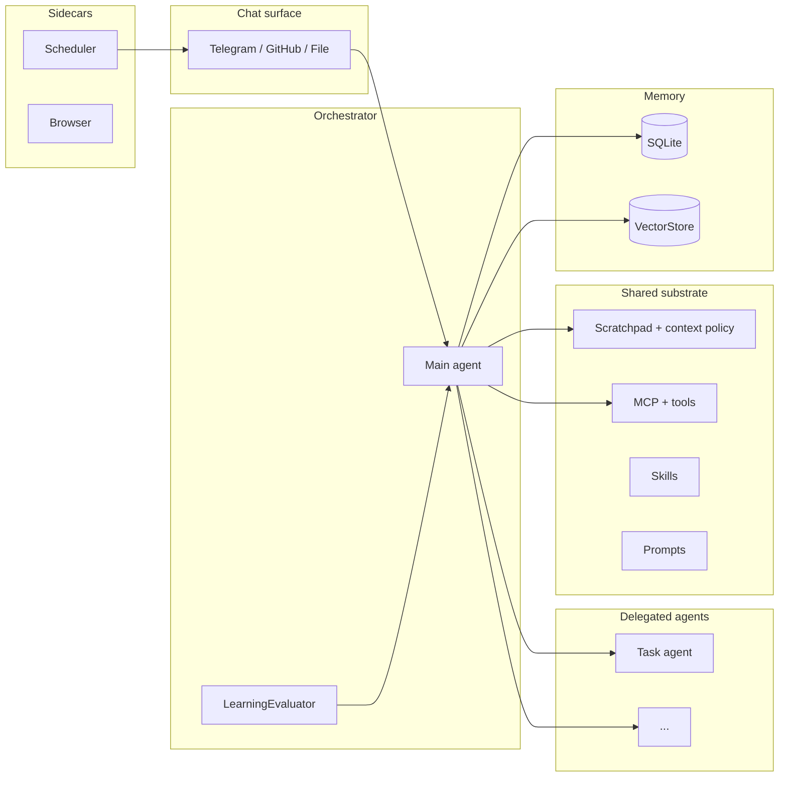

# nanobot

A personal AI agent that orchestrates subagents, browses the web autonomously, runs sandboxed scripts, and learns from every conversation — all on your own hardware, over a chat interface.

## Why nanobot?

I wanted an AI assistant that actually lives on my machine — no cloud dependency, no vendor lock-in, no sending everything to someone else's API. Something that remembers what I care about, can browse the web for me, and gets better at helping over time.

NanoBot runs locally, talks to local LLMs (Ollama, vLLM, anything OpenAI-compatible), and keeps a scratchpad so it doesn't lose track mid-conversation — structured working state for its goal, current step, and what it's learned from tools so far. Longer-term memory: SQLite for exact history, and a vector store for semantic recall of facts and preferences. It doesn't try to be a full operating system — it handles the things I actually need help with through chat: searching, browsing, scheduling, running scripts, and delegating multi-step work to subagents.

## Key Concepts

- **Channels** — Telegram, GitHub, and FileChannel all share a common `Channel` abstraction. Messages from any surface flow through the same orchestrator.
- **Orchestration** — The main agent can spawn specialized subagents for focused tasks, each with its own tool access and run tracking.
- **Skills** — Auto-learned behaviors that persist across conversations. Three trigger modes let the bot inject relevant context at the right time, and a learning evaluator extracts new skills from good turns.
- **Scratchpad** — The bot's structured working memory during a turn: goal, current step, accumulated facts, and a tool journal. Init at start, append after each tool call, finalize before the answer. Not long-term storage — it's how the bot keeps its place in multi-step tasks.
- **Memory** — SQLite for exact transcript and structured facts. VectorStore (Qdrant) for semantic recall across three collections (memories, skills, web scripts).
- **MCP Extensibility** — Plug in any Model Context Protocol server for new capabilities. Built-in servers for timer, scheduler, web search, and browser automation via Playwright.

## How It Works



Messages flow from channels through an async queue into the orchestrator, which dispatches to subagents or handles commands directly. Each subagent gets access to the shared substrate — tools, scratchpad, skills, and prompts. After each turn, the learning evaluator may extract skills from the conversation.

> For full architecture details — storage boundaries, hook system, agent loop exit paths, and implementation specifics — see [ARCHITECTURE.md](ARCHITECTURE.md).

## Features

### Multi-channel

Telegram, GitHub, and FileChannel share a common `Channel` abstraction. Messages from any channel flow through the same orchestrator.

### Skills system

Three trigger modes: `always` (inject every turn), `pattern` (regex match), `intelligent` (semantic similarity via vector store). The bot can manage its own skills at runtime through built-in CRUD tools.

### Learning evaluator

Three-phase pipeline: quality assessment, learning extraction, and skill lifecycle (create/update/deprecate). Over time, the evaluator turns good conversations into reusable skills. Enable via `enable_evaluator: true` in config.

### Plans

The `/plan` command creates structured plans with steps, constraints, and success/failure tracking. Each plan run captures intake, execution, and recovery phases.

### Web scripts / NanoScripts

Sandboxed Python extraction scripts stored via MCP tools. An AST validator blocks unsafe imports and calls. Scripts are indexed for semantic search, so the bot can find and reuse relevant scripts automatically.

### Memory & vector store

Native `VectorStore` backed by Qdrant with three collections: memories (facts/preferences), skills (skill embeddings), and web_scripts (script embeddings). Seven built-in memory tools handle search, save, update, and health — not an MCP server, but direct built-in tools.

**Embedding dimensions must match.** `embedding_dims` in the embedder config must equal the model's actual output. `mxbai-embed-large` = 1024 dims. Must also match `embedding_model_dims` in the vector_store config. If you change embedding models, re-create Qdrant collections. Recommended: `mxbai-embed-large` (1024 dims, best quality) or `nomic-embed-text` (lighter/faster fallback).

## Quick start

1. Install [uv](https://docs.astral.sh/uv/) and [just](https://github.com/casey/just), then set up:

```bash
just setup
```

2. Copy config and set env vars:

```bash
cp config.example.yaml config.yaml
export TELEGRAM_BOT_TOKEN="..."
```

3. Run:

```bash
just run
```

An OpenAI-compatible endpoint serving embedding models (e.g. LM Studio, Ollama) must be running at the configured URL for memory, skills, and web scripts to work. See `config.mem0.yaml` for embedder settings.

## MCP servers

All MCP servers are configured as `mcp_servers` entries in `config.yaml` (see `config.example.yaml` for full format).

| Server | Command | Tools |
|--------|---------|-------|
| timer | `python -m nanobot.mcp_servers.timer.server` | `time_now`, `time_epoch` |
| scheduler | `python -m nanobot.mcp_servers.scheduler.server` | `schedule_task`, `list_tasks`, `delete_task`, `pause_task`, `resume_task`, `cron_list`, `cron_add`, `cron_remove` |
| web | `python -m nanobot.mcp_servers.web.server` | `web__search_web`, `web__read_page` (Tavily/Exa API key required for search) |
| playwright | `npx -y @playwright/mcp@latest --browser chrome --headless` | Browser navigation, click, type, extract (requires Node.js 18+, Chrome) |

## Web agent

The `interact_page` tool (via `src/web_agent/`) provides structured page interaction with multi-tab support, wrapping `BrowserInteractor` for Playwright-based navigation and extraction.

| Action | Fields | Notes |
|--------|--------|-------|
| `click` | `target` | Auto-detects new tabs |
| `type` | `target`, `text` | |
| `select` | `target`, `value` | |
| `scroll` | `amount` or `until_text` | |
| `wait_for` | `selector` or `text` | |
| `switch_tab` | `index` | Return to a background tab by index |

## Debug CLI

```bash
just debug scopes
```

| Command | Description |
|---------|-------------|
| `just debug scopes` | List message scopes |
| `just debug ctx <scope>` | Show context report for a scope |
| `just scheduler-list` | List scheduled tasks |
| `just plan-list` | List recent plan run context traces |

Full command reference: `just --list`. For direct CLI usage, see `uv run python -m nanobot.debug_cli --config config.yaml --help`.

## Quick reset

```bash
just reset              # clear scheduler + history + context + mem0
just reset-dry          # preview counts only
just reset-local        # clear local SQLite only, keep mem0
```

After a reset, re-index intelligent skills:

```bash
just resync-skills
```